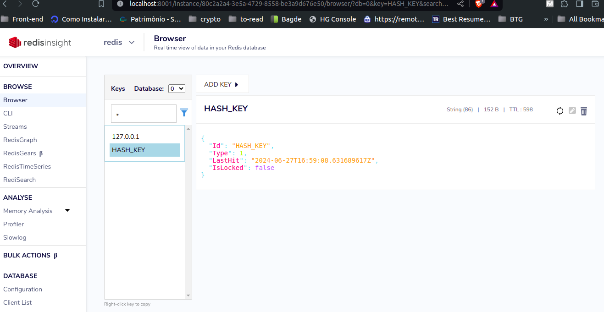

# 🚀 How to Run Your Rate Limiter Project

Follow these steps to get your rate limiter project up and running:

## Prerequisites

Before you start, ensure you have the following installed:

- 🐳 [Docker](https://www.docker.com/get-started)
- 📦 [Docker Compose](https://docs.docker.com/compose/install/)

## Steps to Run the Project

### 1. Clone the Repository

```bash
git clone https://github.com/your-username/your-repo.git
cd your-repo
``` 

### 2. Build and Run the Services

Use Docker Compose to build and run your services.

```
docker-compose up -d
``` 

This command will:

🔄 Build your Go application (my-app)

🛠️ Start a Redis instance

📊 Start Redis Insight for managing your Redis data

### 3. Verify the Services

Ensure the following services are up and running:

- **Redis**: Accessible on port 6379
- **Redis Insight**: Accessible on port 8001
- **Your Go App**: Accessible on port 8080

### 4. Accessing the Services
   - 🌐 **Redis Insight:** Open your browser and go to http://localhost:8001
   - 🌐 **Your Go App:** Access your rate limiter API at http://localhost:8080/ping

### 5. Configuing rate limiting base on IP or API_KEY 
#### 5.1 IP

````
IP_CONFIG_LIMIT_RATE=1 # -> requests/seconds
IP_LOCKED_TIME=1  # -> time(in seconds) to unlock client after reach the limit
```` 
#### 5.2 API_KEY

````
API_KEY_CONFIG_LIMIT_RATE=4  # -> requests/seconds
API_KEY_LOCKED_TIME=50 # -> time(in seconds) to unlock client after reach the limit
````
### 6. Testing Api
#### 6.1 IP

````
for i in {1..500}; do curl --request GET   --url http://localhost:8080/ping; done
```` 

#### 6.2 API_KEY

````
for i in {1..50}; do curl --request GET \ --url http://localhost:8080/ping   --header 'API_KEY: HASH_KEY'; done
```` 
### 7. Verifing information about Rate limiter

